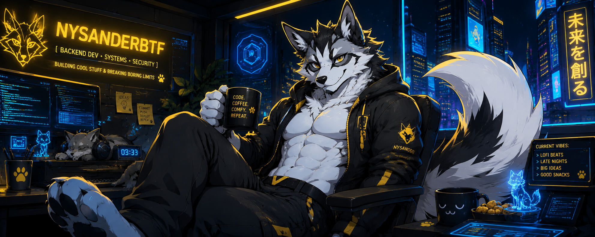

#  Hey, I’m NysanderBTF

  

  

---

## 🐾 About Me

- 🦊 Cyberpunk furry backend dev with fox energy
- 🐍 Python-first engineer building APIs, services, and automation
- ☸️ DevOps focus: Kubernetes, GitOps, Flux, Docker, CI/CD, Linux
- 🔐 Security-minded, auth-heavy, and infrastructure-aware
- 🌌 A lot of my real production work is under NDA/private infrastructure, so the public repos are only the visible edge of the iceberg

---

## ⚙️ Tech Stack

  

---

## 🚀 Featured Projects

### 🖼️ furai
Furry image generation pipeline built around FLUX.2-dev, Gradio, LoRA support, FP8/BF16 modes, and heavy offloading workflows.

### 🌦️ weather_microservice
Python microservice with Celery workers, parsing jobs, and API endpoints for weather data.

### 🔐 auth_mvp
Authentication-focused backend MVP for secure login flows and session-based auth.

### 🧩 fullstack_vue_django_test
Full-stack Vue 3 + Django 4.2 project.

### 🎓 CourseManagement
Backend system for course and learning management workflows.

---

## 🛰️ Private / NDA Work

- Large-scale Python services
- Kubernetes and Flux GitOps
- Auth and session systems
- Internal automation and deployment pipelines
- Security-sensitive backend work

---

## 📊 Stats

  
  

---

## 🌐 Contact

  

